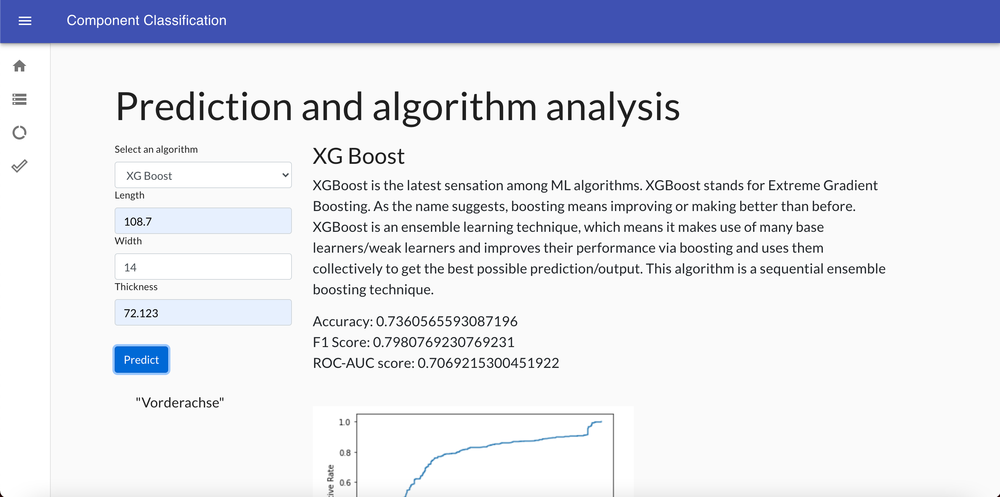

# Component-Classification
A Machine Learning Solution in PLM domain for product data classification.

### Techologies used
1. Implementation of ML models
> AWS Sagemaker

> AWS ECR

> AWS S3

2. Deployment of models
> AWS Lambda

> AWS API Gateway

3. User Interface
> ReactJS

> Material UI

### Screenshots of UI

